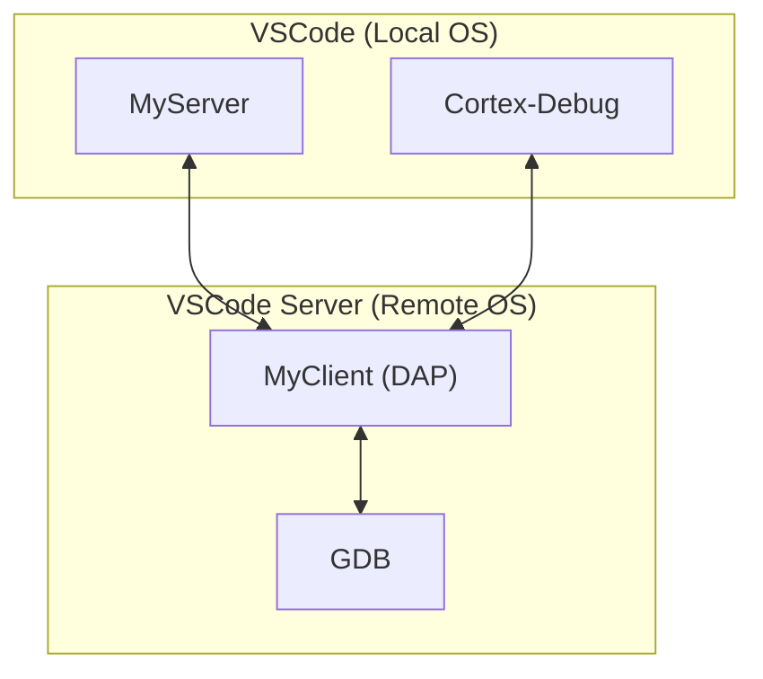

The new debug adapter architecture will split the debug adapter into a client and a server

## Problem definition

Before we delve into the details, what is the problem we are solving? Today, running the extension in WSL or a container is problematic. They may not have good access to the USB ports that connect to the board. We have USBIP but it is very fussy and setip can be problematic. Less of a problem on Linux perhaps.

## Server

The server is responsible for managing and orchestrating the start of the gdb-server. It can run anywhere but most likely on the Host side of the Container/WSL. Once the server starts, there is not much happening other than shuttling stdio. We need this to be bidirectioal and support all three channels (stdin, stdout, stderr). Our design is that we never talk to the gdb-server directly. We always go through gdb via `monitor` commands. There is two exceptions

- OpenOCD requires that we poll on the TCL channel to start RTT
- With JLink, there is a startup procedure where we have to switch RTT ports in the first few ms. Should look into what mechanism we use for this

There are two aspects of the gdb-server orchestration

### 1. TCP Port selection.

During startup, we know how many TCP channels we need and for which purpose. These channels must be allocated on the host side where the gdb-server actually runs. The typical ports are one port per gdb, swo, and rtt each per core. The gdb port(s) is simply handed over to gdb remote-target command

In this case, the client decides the strategy and the number of ports needed. This is a request made by the client to the server to allocate the needed ports.

The server shall, for each port, wait until the port is open and simply provide a bidirectional transfer of data with zero buffering. For each host port, there is a corresponding local port.

There is a special case and the most prevalent case where the client and server are running on the same machine. In this case, the server will not be involved, but the client will not care if the host is 1127.0.0.1 or something else

**The most critical information needed is the IP address of the host computer**
But what starts the server? There are a couple of possibilities

1. We use VSCode to launch the server and the lifecycle of the workspace. Our server has nothing to do with VSCode so this may sound dumb as to why we would rely on that. Some reasons are discovery, distribution(installation), updates. The discover may be the msot important reason. Another reason is that NodeJS is already bundled and available.
2. Standalone server. In this case, it can run forever in daemon-mode and can handle multiple clients. The only state the server has is the process information for each gdb-server launched and the only reason to have this is to provide a service to kill. But even this state can be maintained by the client. But for security reasons, perhaps we should not offer a kill service using a PID. It should be session based.

Even in the standalone more, VSCode can still be used as a vehicle for distribution. We will debate this later.

### 2. gdb-server lifecycle management

We shall recieve the commandline from the client. This occurs after the port-allocation. There is a window of vulnerability here were between the time the ports were allocated and the client making a request to launch the server, a port(s) can be claimed by someone else. To mitigate this window, the server could keep the ports open/busy until the launch command is received. Once the launch commmand is received, we close all the ports and launch the gdb-server. Note that the gdb-server itself may takes its sweet time before it opens the ports...so this vulnerability always existed, but now this window is a bit larger. See also the kill service mentioned above

Why have a kill service? Some gdb-servers do not exit even in single-shot more after gdb-disconnects. But it is their right to do so, and they do not have to even offer a single-shot mode. After the client asks gdb to detach/disconnect if the server is still hanging around, then we may not be able to start another session because it is probably blocking access to USB ports.

Note: For JLink, a single debug session may involve launching several gdb-servers (one for each core). So, one session may involve one or more gdb-servers.

## Client

The Client is the rest of the Debug Adapter as it exists today. GDB is always launched local to the client computer. The client OS can be thought of as the "Remote OS" in VSCode lingo and the server runs on the host which is "Local OS" in VSCode lingo. See https://code.visualstudio.com/docs/remote/remote-overview Yes, this is confusing because in my lingo, the server goes with the gdb-server and GDB and the DAP are clients. So, with my naming convention the relationship is reversed. Ask AI to help rename or use alternate terminology

## Putting it all together

With VSCode as an example, we have the following

