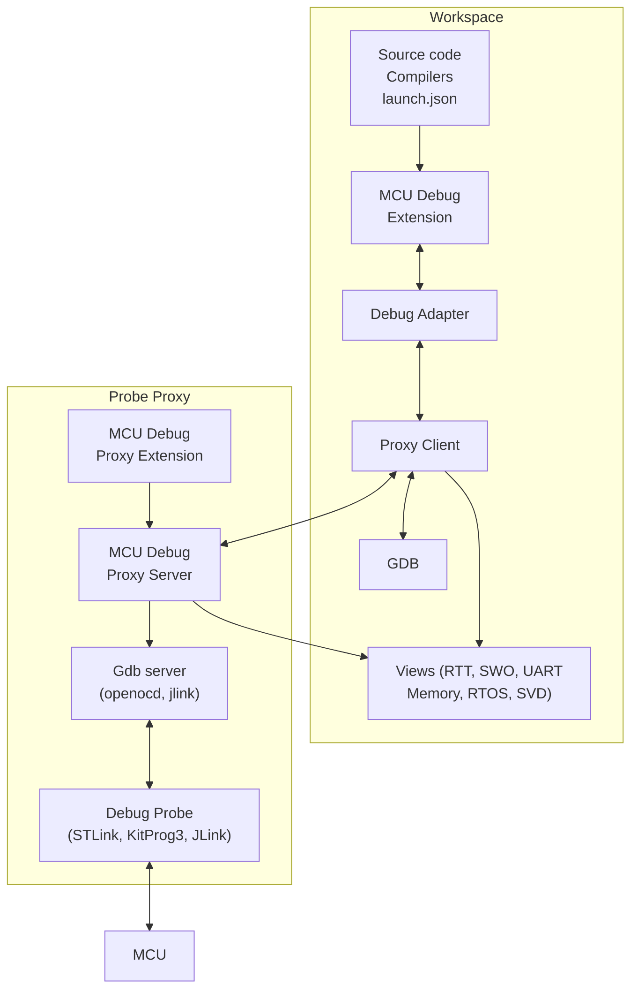
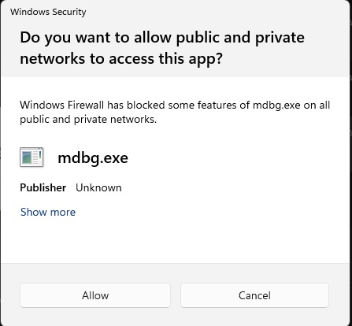

# Remote Debugging

mcu-debug supports debugging scenarios where the debug probe is on a different machine or OS from your editor. This is common in Windows+WSL development workflows, Docker dev containers, and shared lab server setups.

:::note
For terminology, for example with WSL or Docker, `"remote"` is your host machine/OS and `"local"` is your WSL/Docker/Guest-VM environment. Local is where your files and build artifacts live. Remote is also where your debug probe is physically attached to.
:::

## Architecture

In the picture below, the "Workspace" and the "Probe Proxy" can be on very different comuters. The "proxy" server provides access to the HW Probe as if it is locally available. The connection is handled depending on the type of the environment each part is. The Workspace can be inside WSL or Docker. The "Probe" could be on a host machine hosting the WSL/Docker environment or some other machine The system automatically detects the type of the "Workspace" environment with the help of VSCode. But you can always use `ssh` to connect the two environments. The same architecture is also used for CLI mode except VSCode services cannot be used but the Probe environment can be described in launch.json. However, for WSL, CLI mode will detect and make the connection automatically



## Supported Topologies

| Topology                     | Use Case                                                | Setup                                                          |
| ---------------------------- | ------------------------------------------------------- | -------------------------------------------------------------- |
| [WSL](./wsl.md)              | Linux dev environment, probe physically on Windows host | Auto-detected via `WSL_DISTRO_NAME`; minimal config            |
| [Docker](./docker.md)        | Dev container, probe on Docker host machine             | Auto-detected via `/.dockerenv`; set `hostConfig.type: "auto"` |
| [SSH / Lab Server](./ssh.md) | Probe on remote server, developer on laptop             | Explicit `hostConfig` with host name                           |

## The `hostConfig` Property

All remote topologies are configured via the `hostConfig` block in `launch.json`: For everything except for 'ssh', the `hostConfig` can be a simple boolean, for non-CLI use

```json
"serverpath": "<path-to-gdb-server-on-remote>",
"hostConfig": true
```

the above is equivalent to the following

```json
"serverpath": "<path-to-gdb-server-on-remote>",
"hostConfig": {
  "enabled": true,
  "type": "auto"
}
```

For explicit SSH configuration. The `port`/`token` are determined by contacting the `host` and starting the proxy server if needed:

```json
"serverpath": "<path-to-gdb-server-on-remote>",
"hostConfig": {
  "enabled": true,
  "type": "ssh",
  "ssh": {
    "host": "lab-server"
  }
}
```
The above involves more steps like copying the server executable, so not recommended for performance. It is however convenient since versions are guaranteed to match

For totally explicit SSH configuration where you started the proxy server yourself:

```json
"serverpath": "<path-to-gdb-server-on-remote>",
"hostConfig": {
  "enabled": true,
  "type": "ssh",
  "ssh": {
    "host": "lab-server",
    "proxyPort": 5689,
    "token": "${env:MDBG_PROXY_TOKEN}"  // Avoid putting actual token 
  }
}
```

## Connecting to an Agent You Started Yourself

Every topology above detects your environment and launches the Probe Agent for you. When
that is not what you want — a CLI-only container, a CI runner, a shared lab machine, or
anywhere the agent's lifetime is managed outside the editor — name the endpoint directly
and mcu-debug will skip detection entirely:

```json
"hostConfig": {
  "enabled": true,
  "proxy": {
    "host": "172.28.240.1",
    "port": 55555,
    "token": "${env:MDBG_PROXY_TOKEN}"
  }
}
```

The above also applies to "ssh" but the launch.json should be for "ssh" as shown in the previous section

Start the agent yourself on the machine with the probe:

```bash
# Shutdown any old daemon running, existing sessions will continue to run.
# You can also do 'killall mdbg' to kill forcefully or use the Task manager

mcu-debug proxy --shutdown --all

export MDBG_PROXY_TOKEN=$(openssl rand -hex 16)   # any value, as long as both ends agree
mcu-debug proxy --host 172.22.112.1 --port 55555
```

The above will print the actual port and token being used. If the previous proxy was not shutdown,
then it will ignore your port/token specifications and continue to use the old ones. For WSL in nat
mode you must use the actual IP address of the host assigned to the. For WSL mirrored mode, containers
and ssh, you can use 127.0.0.1 as the host. This is good practice to avoid firewall issues as well as
for security.

If you are using WSL-nat mode, consider switching to WSL-mirrored mode. For WSL-nat, you can dynamically
determine the WSL host IP address using

```sh
wsl.exe ip route show | grep -i default | awk '{ print $3 }'
 ```

`mcu-debug proxy --status` reports the `port` and the `hosts` it is bound to — use those
values. The `host` must be an address the agent is actually bound to *and* that the debug
adapter can reach; those are two different questions when a container or VM is involved.

:::note
**All three fields are required.** An endpoint without a token is rejected by the agent
at connect time, which surfaces far from the mistake and is hard to diagnose, so
mcu-debug reports the incomplete configuration up front instead. The one flexibility:
the token may come from the `MDBG_PROXY_TOKEN` environment variable instead of
`launch.json`, which is the recommended way — a token in `launch.json` is a shared secret
committed to source control. The agent reads the same variable, so one export configures
both ends.
:::

When `proxy` is set, `type` is ignored — you have told mcu-debug where the agent is, so
there is nothing left to detect. This does **not** apply to the SSH topologies: `ssh`
needs its `-L` tunnel established before any endpoint exists, and VS Code Remote-SSH
needs its reverse tunnel. For a pre-running agent on a lab server over SSH, use
`ssh.proxyPort` (with `ssh.token`) instead.

## WSL-nat Security warning

You may see the following dialog box the first time (for every new release) you use the proxy.
You have to accept if you want to continue debugging



## Configuring the gdb-server for remote

Some gdb servers require bare minimum configuration. Others like openocd may need quite a bit depending on your MCU

Note that the gdb-server will be started on the remote server where the debug probe is attached. Regardless of the type of remote (WSL, Docker, ssh, etc.) the server needs to be started properly and it has to find all the files it needs locally on the remote machine. We also need to know the path to the gdb-server.

:::note
- **The full path name to the gdb-server on the remote machine is needed** The `serverpath` in launch.json is needed because the remote server is not running in VSCode and does not have access to any VSCode settings.
- `serverpath` is not needed if the server executable is installed globally and accessible via `$PATH` env. variable. You can also use VSCode workspace (or global) settings for your specific gdb-server path
- Any files that the gdb-server needs need to be specified in terms of path-names on the remote
- In openocd case, the `searchDir` needs to be in terms of the remote paths
:::

To this end, we provide a way to synchronize files between the two machines. Any paths relative to the your launch.json `cwd` can be specified in the `syncFiles` and they will be copied to a temporary directory on the remote. Note that this is not meant to transport large amounts of data. It is currently limited to 20 files and no single file can exceed 10 MB. This file sizes have a very large impact on startup performance and our transport mechanism is not optimized for high throughput.

The following is a complex example of `syncFiles` because there is quite a bit that is non-standard.

```json
"serverpath": "<path-to-gdb-server-on-remote>",
"hostConfig": {
  "enabled": true,
  "type": "auto",
  "syncFiles": [
      {"local": "openocd.tcl"},
      // Following is not needed if the executable was an elf file since gdb can load that data directly
      // In this case, we are loading via openocd. Not a normal flow but this is an example of how things
      {"local": "build/last_config/mtb-example-hal-hello-world.hex"}
  ],
},
// Note how the hex file is reference in openocd launch commands
"overrideLaunchCommands": [
  "monitor program {build/last_config/mtb-example-hal-hello-world.hex}",
  "monitor reset run",
  "monitor psoc6 reset_halt sysresetreq"
],
```

### Rules for `syncFiles`

Please keep your `syncFiles` simple and small. An rsync or a network drive may be a better method

```typescript
/**
 * Sync files listed in hostConfig.syncFiles.
 *
 * Each entry has the shape:
 *   { local: string, remote?: string }
 *
 * local:
 * - A glob pattern (resolved from launch/attach configuration "cwd"), or
 * - A direct file path (absolute or relative).
 *
 * remote:
 * - Optional destination path on the remote side.
 * - Always interpreted relative to the proxy session root directory on the server.
 * - Must be a safe relative path (no absolute paths, no ".." traversal).
 * - The remote directory is randomly created and cannot be relied upon between sessions
 *
 * Destination behavior:
 * - If a matched local file is inside this.cwd:
 *   - Preserve its path relative to this.cwd.
 *   - If remote is provided, prepend remote as a base directory.
 * - If a matched local file is outside this.cwd:
 *   - If remote is provided and only one file is matched, remote is treated as the exact destination file path.
 *   - If remote is provided and multiple files are matched, remote is treated as a directory and each basename is appended.
 *   - If remote is omitted, fall back to the local basename at session root.
 *
 * Notes:
 * - Paths sent to the server always use forward slashes for cross-platform consistency.
 * - The server creates parent directories under the session root as needed.
 * - There are limits on the number (20) and size (10 MB) of files that can be synced to prevent abuse and performance issues.
 */
```

## How Remote Debugging Works

mcu-debug runs a small **proxy agent** on the machine where the probe is physically connected. The proxy:

- Starts and manages the gdb-server process
- Exposes a multiplexed TCP tunnel back to the debug adapter
- Handles GDB RSP and RTT traffic over the same tunnel

The debug adapter (running in VS Code or the CLI) connects to the proxy rather than directly to the gdb-server. Everything else — GDB, RTT, UART, the launch.json configuration — works identically to local debugging.

## VS Code Port Forwarding

During a remote session the debug adapter opens listeners on the **workspace** side — three to
five per core (gdb, tcl, telnet, SWO, console), one per serial view, one per RTT channel. All of
them bind `127.0.0.1`, and GDB and the views connect to them from that same machine.

VS Code's Remote extensions notice these and forward them back to your local machine. The
forwarding itself is harmless — a forwarded loopback port stays as private as the original — but
two of VS Code's reactions to it are worth pre-empting.

### Do not open these ports in a browser

VS Code sometimes offers to open a forwarded port in a browser. **Decline for gdb, tcl and telnet
ports.** A browser sends `GET / HTTP/1.1`, which those endpoints try to interpret as their own
protocol; at best nothing happens, at worst the gdb-server shuts down and takes your session with
it.

### Twenty forwarded ports changes your settings

Past twenty, VS Code switches automatic port forwarding from `process` to `hybrid` and notifies
you that it has done so. This is easier to reach than it sounds: a single-core session already
sits around seventeen ports, most of them VS Code's own, so a second core or a handful of RTT
channels crosses the threshold.

### Settling both

Give mcu-debug's port band its own rule in the **workspace-side** `settings.json`:

```json
"remote.portsAttributes": {
    "2000-2600": { "onAutoForward": "ignore", "label": "mcu-debug internal" }
}
```

`ignore` means "do not forward at all", which removes the browser offer and keeps the port count
down. It is the right answer whenever everything that talks to these ports lives on the workspace
side — which is the case for WSL in mirrored mode, and for dev containers.

Use `"onAutoForward": "silent"` instead if you are unsure. That keeps the forwarding and only
suppresses the noise, so it cannot break a topology that turns out to depend on it. WSL in **NAT**
mode is the case to be careful with; see [WSL](./wsl.md#vs-code-port-forwarding).

The `2000-2600` range is mcu-debug's own allocation band, so neither setting affects the ports
your other projects use.

## Prerequisites

- The `mcu-debug proxy` binary must be available on the host machine (the machine where the probe is connected). Using the `mcu-debug-proxy` extension in VSCode makes this simple. Note: We create version independent scripts in `~/.mcu-debug/bin` directory to access the proxy server but you have to load the `mcu-debug` extension into VSCode atleast once per version. It is totally transparent using the `mcu-debug proxy` extension
- For SSH mode: SSH access to the host (key-based authentication recommended)
- For WSL and Docker: the proxy may need to be started manually if not using VS Code Remote extensions. See [SSH configuration](ssh.md)
