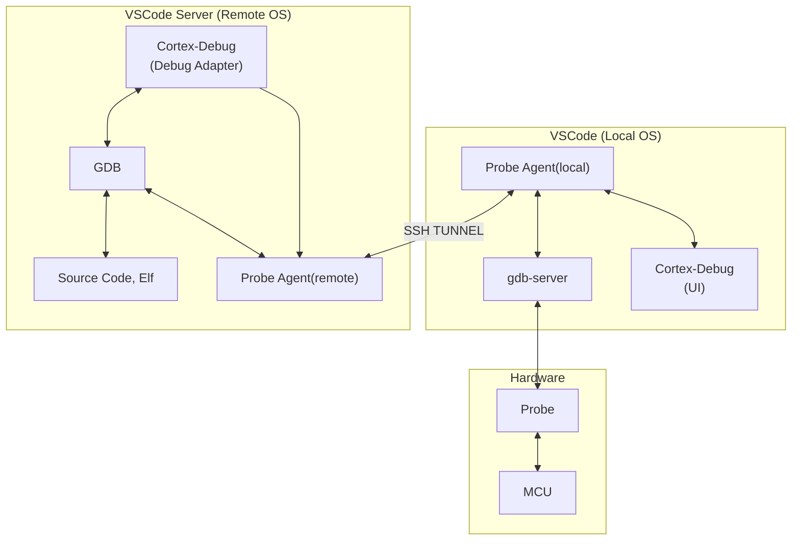
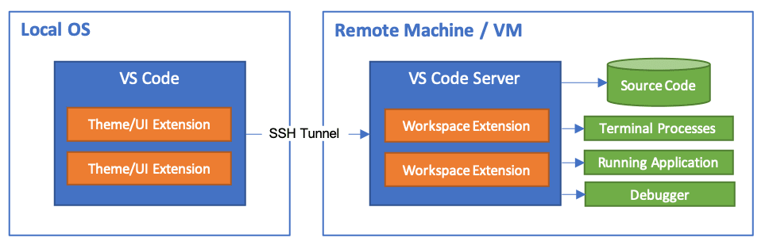

# Cortex-Debug replacement

For this iteration, we will keep most of the frontend functionally equivalent to Cortex-Debug. But the backend (DAP adapter) will be totally new. All though we will have a new backend, we will still maintain compatibility with gdb-server support for all existing ones. Again, functionally equivalent and any changes should not be externally visible

The new debug adapter architecture will split the debug adapter into a client and a server

## Problem definition

Before we delve into the details, what is the problem we are solving? Today, running the extension in WSL or a container is problematic. They may not have good access to the USB ports that connect to the board. We have USBIP but it is very fussy and setip can be problematic. Less of a problem on Linux perhaps.

## Server

The server is responsible for managing and orchestrating the start of the gdb-server. It can run anywhere but most likely on the Host side of the Container/WSL. Once the server starts, there is not much happening other than shuttling stdio. We need this to be bidirectioal and support all three channels (stdin, stdout, stderr). Our design is that we never talk to the gdb-server directly. We always go through gdb via `monitor` commands. There is two exceptions

- OpenOCD requires that we poll on the TCL channel to start RTT
- With JLink, there is a startup procedure where we have to switch RTT ports in the first few ms. Should look into what mechanism we use for this

There are two aspects of the gdb-server orchestration

### 1. TCP Port selection.

During startup, we know how many TCP channels we need and for which purpose. These channels must be allocated on the host side where the gdb-server actually runs. The typical ports are one port per gdb, swo, and rtt each per core. The gdb port(s) is simply handed over to gdb remote-target command

In this case, the client decides the strategy and the number of ports needed. This is a request made by the client to the server to allocate the needed ports.

The server shall, for each port, wait until the port is open and simply provide a bidirectional transfer of data with zero buffering. For each host port, there is a corresponding local port.

There is a special case and the most prevalent case where the client and server are running on the same machine. In this case, the server will not be involved, but the client will not care if the host is 1127.0.0.1 or something else

**The most critical information needed is the IP address of the host computer**
But what starts the Probe Agent? There are a couple of possibilities

1.  **VS Code Extension Split (Preferred):** VS Code allows extensions to define where they run. We can structure the extension such that a "UI" portion runs on the Local Host (where the USB ports are) and the "Workspace" portion runs on the Remote Host (WSL/Container). The Local Host portion can spawn the Probe Agent automatically when a debug session starts. This is the most seamless experience as it requires no extra installation steps for the user.
2.  **Helper Extension:** If the split model proves too complex, a separate lightweight "Probe Agent Extension" could be installed on the Local Host side to manage the lifecycle and provide an API for the main extension to communicate with.
3.  **Standalone Server:** In this case, it can run forever in daemon-mode and can handle multiple clients. The only state the server has is the process information for each gdb-server launched and the only reason to have this is to provide a service to kill. But even this state can be maintained by the client. But for security reasons, perhaps we should not offer a kill service using a PID. It should be session based.

Even in the standalone mode, VS Code can still be used as a vehicle for distribution. We will debate this later.

### 2. gdb-server lifecycle management

We shall recieve the commandline from the client. This occurs after the port-allocation. There is a window of vulnerability here were between the time the ports were allocated and the client making a request to launch the server, a port(s) can be claimed by someone else. To mitigate this window, the server could keep the ports open/busy until the launch command is received. Once the launch commmand is received, we close all the ports and launch the gdb-server. Note that the gdb-server itself may takes its sweet time before it opens the ports...so this vulnerability always existed, but now this window is a bit larger. See also the kill service mentioned above

Why have a kill service? Some gdb-servers do not exit even in single-shot more after gdb-disconnects. But it is their right to do so, and they do not have to even offer a single-shot mode. After the client asks gdb to detach/disconnect if the server is still hanging around, then we may not be able to start another session because it is probably blocking access to USB ports.

Note: For JLink, a single debug session may involve launching several gdb-servers (one for each core). So, one session may involve one or more gdb-servers.

## Client

The Client is the rest of the Debug Adapter as it exists today. GDB is always launched local to the client computer. The client OS can be thought of as the "Remote OS" in VSCode lingo and the server runs on the host which is "Local OS" in VSCode lingo. See https://code.visualstudio.com/docs/remote/remote-overview Yes, this is confusing because in my lingo, the server goes with the gdb-server and GDB and the DAP are clients. So, with my naming convention the relationship is reversed.

**Terminology Update:** To avoid confusion, we will use the following terms:
*   **Debug Adapter**: The VS Code extension running in the user's environment (Container, WSL, or Local).
*   **Probe Agent**: The lightweight server running on the Host OS that manages the USB probe and GDB Server process.

## Putting it all together

With VSCode as an example, we have the following


This kind of an architecture is also used by VSCode. See [Remote Development using SSH](https://code.visualstudio.com/docs/remote/ssh)



The difference is that the debug probe and HW are on the Local OS

Here is a proposed structure for the **Funnel Protocol** using a JSON-RPC 2.0 style.

### 1. Packet Format

Since JSON is "heavy" for raw byte streams like RTT, the most efficient way to do this is a **Hybrid Approach**: JSON-RPC for "Control" (opening/closing ports) and "Binary Frames" for the actual debug data.

#### The Binary Frame (The Funnel)

To keep it "Zero-Buffering," every packet through the SSH tunnel should have a small header:
| Field              | Size    | Description                                      |
| :----------------- | :------ | :----------------------------------------------- |
| **Stream ID**      | 1 Byte  | `0`: Control, `1`: GDB, `2`: SWO, `3`: RTT, etc. |
| **Payload Length** | 4 Bytes | UInt32 (Little Endian)                           |
| **Payload**        | N Bytes | The raw data (JSON string or raw bytes)          |

---

### 2. Control Packet Types (JSON-RPC)

These packets always travel on **Stream ID 0**. They manage the "Ghost Ports" and security.

#### `initialize` (The Handshake)

This is the first packet sent by the Debug Adapter to the Probe Agent.

```json
{
  "jsonrpc": "2.0",
  "method": "initialize",
  "params": {
    "token": "high-entropy-secret-key",
    "version": "1.0.0",
    "capabilities": ["multi-stream", "compression"]
  },
  "id": 1
}

```

#### `startStream` (Port Mapping)

The Debug Adapter tells the Probe Agent to connect to a specific local port (e.g., the actual GDB server).

```json
{
  "jsonrpc": "2.0",
  "method": "startStream",
  "params": {
    "streamId": 1,
    "type": "tcp",
    "port": 3333,
    "host": "127.0.0.1"
  },
  "id": 2
}

```

#### `streamStatus` (Lifecycle)

Sent by either side to signal that a specific "pipe" has been broken (e.g., the GDB server crashed).

```json
{
  "jsonrpc": "2.0",
  "method": "streamStatus",
  "params": {
    "streamId": 1,
    "status": "closed",
    "reason": "Connection reset by peer"
  }
}

```

---

### 3. The Heartbeat (Keep-Alive)

SSH tunnels are notorious for "silently dying" if no data flows for a few minutes (especially through aggressive NAT firewalls).

#### `heartbeat`

The Debug Adapter sends this every 30 seconds if the line is quiet. If the Probe Agent doesn't acknowledge within a timeout, the Debug Adapter tears down all "Ghost Ports" so the user knows the session is dead.

```json
{
  "jsonrpc": "2.0",
  "method": "heartbeat",
  "params": {
    "timestamp": 1735046622
  }
}

```

---

### 4. Handling Binary Streams (The "Raw" Mode)

For **GDB**, **SWO**, and **RTT**, we should skip JSON entirely once the stream is established to avoid the "Base64 Tax" (which adds 33% overhead) and CPU overhead.

1. **Control Message:** `[ID:0][Len:124][{"jsonrpc":...}]`
2. **GDB Data:** `[ID:1][Len:4096][...raw binary bytes...]`
3. **RTT Data:** `[ID:3][Len:12][...raw RTT string...]`

### Why this structure works for you:

* **Agnostic:** The "Funnel" doesn't need to know *what* is in Stream 1. It just moves the bytes.
* **Responsive:** Because the header is only 5 bytes, the latency is negligible.
* **Secure:** By checking the `token` in the `initialize` call, you prevent anyone else on the remote host from hijacking your gdb-server proxy.

In the world of TCP, the odds of a packet being "broken up" are **100%**.

TCP is a **stream-oriented** protocol, not a **message-oriented** one. It guarantees the *order* and *integrity* of the bytes, but it makes no promises about where one of your logical "packets" ends and the next begins. This is the most common trap when moving from local development to a Proxy/Remote model.

### 1. The "Fragmentation" Reality

If you send a 100-byte JSON-RPC message, it might arrive at the other side as:

* One 100-byte chunk (Lucky).
* Two 50-byte chunks.
* One 1-byte chunk followed by 99 bytes.

If you are "tunneling" this over SSH, the SSH layer itself adds another layer of packetization. If you don't handle this, your JSON parser will try to parse `{"jsonrpc": "2.` and crash because the string is incomplete.

### 2. The "Read and Accumulate" Strategy

You definitely shouldn't read a byte at a time (that's too much CPU overhead for the system calls). Instead, you use a **Buffer Accumulator**.

**How to implement it in TypeScript/Node:**

1. **The Inbox:** Maintain a persistent buffer (or an array of buffers) for each connection.
2. **The `on('data')` Event:** When a chunk arrives, append it to your Inbox.
3. **The Parser Loop:**
* **Step A:** Do I have at least 5 bytes (the Header)?
* No? Wait for more data.
* Yes? Read the `Stream ID` and the `Payload Length`.


* **Step B:** Do I have `5 + Payload Length` bytes in the Inbox?
* No? Wait for more data.
* Yes? Extract that specific slice as a complete "Packet."


* **Step C:** Remove the processed bytes from the Inbox and **repeat** (because the chunk might contain the start of the *next* packet).


### 3. Efficiency: "Slicing" vs. "Copying"

In Node.js, using `Buffer.concat()` repeatedly can be expensive because it creates new memory allocations. For your "Funnel," you can use a more efficient "Reader" pattern:

```typescript
// Conceptual logic for the Funnel
let inbox = Buffer.alloc(0);

socket.on('data', (chunk) => {
    inbox = Buffer.concat([inbox, chunk]);

    while (inbox.length >= 5) { // Minimum header size
        const streamId = inbox.readUInt8(0);
        const length = inbox.readUInt32LE(1);

        if (inbox.length >= 5 + length) {
            const payload = inbox.subarray(5, 5 + length);
            processPacket(streamId, payload);
            
            // Advance the inbox
            inbox = inbox.subarray(5 + length);
        } else {
            break; // Need more data for this specific payload
        }
    }
});

```

### 4. Why this matters for RTT and SWO

For binary streams like RTT, this "Framing" is your best friend. Without it, if RTT data and DAP data arrive at the same time, the bytes would interleave and corrupt your JSON. By using the **Header + Length**, you ensure that even if the network breaks a packet into 10 pieces, your code will perfectly reassemble them before passing them to the GDB or SVD logic.

### 5. Heartbeats are the "Reset" Button

The only risk with this pattern is if a header gets corrupted (rare with TCP, but possible with bad memory/logic). If the `Length` field becomes a billion by accident, your code will wait forever.

* **Heartbeats** act as a check: if you haven't received a valid, complete packet in a long time, you flush the inbox and reset the connection.
  
### 6. Code snippet for waiting for channel to be ready

```TS
// Proxy server sends notification when ready
proxyConnection.on('channel_ready', (channelId) => {
  if (channelId === RSP_CHANNEL) {
    this.rspReady.resolve();
  }
});

await this.rspReady.promise;
```

---


