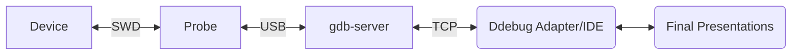
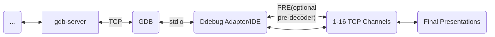

# RTT in MCU Debug

RTT is a powerful way to send data from your FW to a host devie using the existing debug SWD interface. If you are not familiar with it, please read https://www.segger.com/products/debug-probes/j-link/technology/about-real-time-transfer/. SEGGER provides free firmware and your are not limited to using SEGGER probes..

There is support for RTT ([Real Time Trace from SEGGER](https://www.segger.com/products/debug-probes/j-link/technology/about-real-time-transfer/)). Normally, we need support from gdb-servers to make RTT work. gdb-servers like JLinkGDBServer, OpenOCD, etc. provide RTT service over a TCP port. JLink's service is pretty autonomous and all we have to do is let JLink for RTT data with minimal configuration. Only limitation with JLink is that only one channel can be used (max is 16). OpenOCD has another limitation that is not very IDE friendly. Their usage model requires manual polling (or FW knowledge) to enable RTT. In IDEs, the only way we know how to handle that is to poll. Manually they expect the user to use a breakpoint after RTT is initialized and issue a command a command to start RTT. Not very IDE friendly.

This is how RTT works. The "Debug Adapter" can be any debugger (command-line, IDE, etc.). **MCU Debug** provides a debug adapter that conforms to what VSCode API needs

Notice that GDB is not involved at all but the gdb-server performs a critical function of polling for chainges in the RTT. The "Final Presetation" can be many things. A simple Terminal like interface, looging to a file, graphing. In MCU Debug (and Cortex-Debug) you can have multiple ways to present the same channel.

**MCU Debug** supports the model described above but also provides an alternate impelementation that bypasses the gdb-server for RTT data and instead uses GDB to perform memory IO. While it adds a little overhead our performance bottleneck is really the SWD interface. Our architecutre is as follows

#### Notes:

- The "pre-decoder" can be something like Rust's [defmt-print](https://crates.io/crates/defmt-print) which is super efficient and increases the throughput  by an order of magnititude for some use cases. In **MCU Debug**, you can specify any number of pre-decoders or none at all. There can be one optional pre-decoder per RTT channel
- The "Final Presentation" layer can also have multiple ways to present data. This can be useful for logging while viewing data, offline examination, or even debugging the presentation layers.
- Final note is that all the channels can be birectional depending you how your FW is configured. It also depends on what the final user interface looks like. A Terminal could provide that bi-directionality.

The TCP interface can handle several megabytes per second and most of our operations are pipelined. So, SWD is still our limiting factor. It is true that the roundrip to see if any new data is available is much slower compared what a gdb-server can do, in practice, we can still poll every 10ms. Practically, we have seen good results even at 40Hz. So, speed/throughput is important
